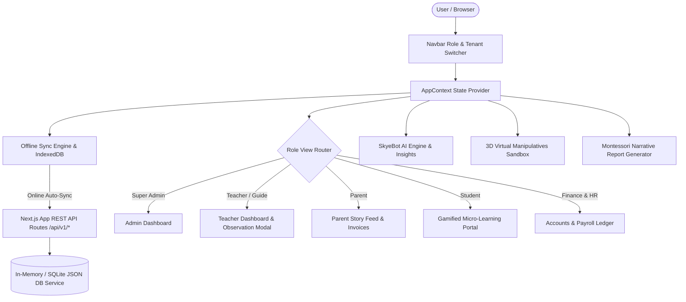
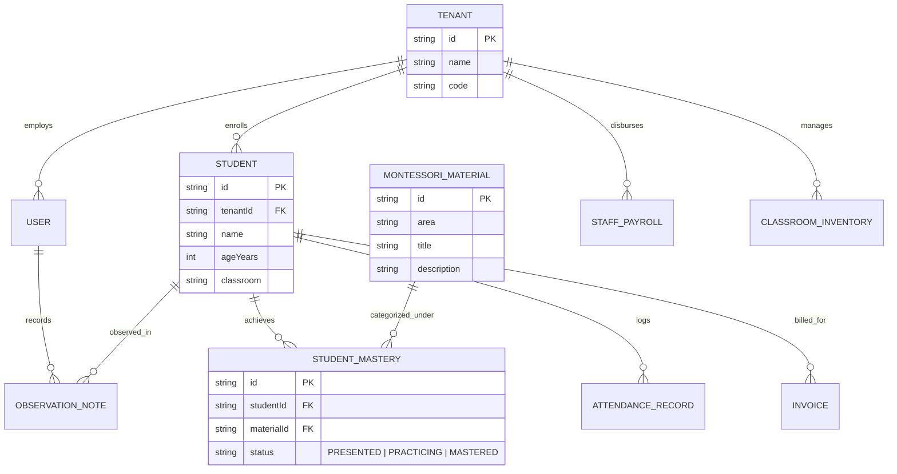

# SKYELAX Montessori ERP & Learning Management System (LMS)

[](https://nextjs.org/)
[](https://react.dev/)
[](https://www.typescriptlang.org/)
[](https://tailwindcss.com/)
[](https://developer.mozilla.org/en-US/docs/Web/Progressive_web_apps)

An enterprise-grade, modern, and scalable **Montessori ERP & Learning Management System** built for the SKYELAX Full Stack Developer Assessment (250 Marks Total).

---

## 🌟 Executive Overview & Key Innovations

This project delivers a comprehensive digital platform specifically designed around **Montessori Pedagogical Philosophy** (Three-Period Lessons, Prepared Environments, Uninterrupted Work Cycles, and Concrete-to-Abstract Materials) while integrating modern ERP capabilities, AI predictive analytics, offline-first sync, and interactive 3D virtual manipulatives.

### Key Highlights & Assessment Modules (250 Marks)
1. **UI/UX Design & Aesthetic Excellence (50 Marks):** Sleek dark-mode aesthetic with vibrant color gradients, glassmorphism blur effects, micro-animations, role-specific interfaces, and responsive navigation.
2. **Database Architecture & Data Integrity (50 Marks):** Structured, normalized schema for multi-tenant campuses, users, student mastery matrices, observational notes, attendance ledgers, tuition invoices, staff payroll, and classroom inventory.
3. **Required Feature Modules (100 Marks):**
   - **Multi-Tenant RBAC:** 5 distinct role perspectives (*Super Admin / Principal*, *Teacher / Guide*, *Parent*, *Student*, *Finance & HR Manager*) with top-bar instant switcher and multi-school campus selector (*Sunrise Montessori Academy* vs *Greenwood Montessori School*).
   - **Montessori Curriculum & Lesson Planning:** Covers 5 Montessori Areas (*Practical Life*, *Sensorial*, *Language*, *Mathematics*, *Culture & Science*), tracking Three-Period Lessons (*Presented*, *Practicing*, *Mastered*).
   - **Observation & Progress Logging:** Live observation recorder with focus tags (*Concentration*, *Repetition*, *Independence*, *Order*, *Coordination*), work period timer, and speech-to-text voice recognition.
   - **Smart Attendance:** QR Code & RFID scanner simulation modal.
   - **Fees, Finance & HR:** Tuition invoicing ledger, instant payment gateway simulation, staff payroll disbursement, and classroom material repair requests.
   - **Montessori Narrative Report Generator:** Printable narrative progress report cards with PDF export view.
4. **AI Predictive Insights & Interactive Assistant (20 Marks):**
   - **AI Insights Engine:** Data-driven recommendations flagging student developmental readiness, area demand peaks, and tuition collection forecasts.
   - **SkyeBot AI Assistant:** Context-aware interactive assistant generating 3-Period lesson plans, parent updates, and ERP analytics queries.
5. **Offline-First Synchronization Engine (20 Marks):**
   - Web Service Worker (`public/sw.js`) and IndexedDB local store.
   - Saves observations and attendance offline when disconnected; automatically flushes queue upon network recovery with real-time status indicators.
6. **Virtual Montessori Sandbox (20 Marks Innovation):**
   - Interactive visualizers for **Golden Beads Decimal System** (Units, Tens, Hundreds, Thousands) and **Pink Tower Sensorial Stacker** (1cm to 10cm cube scale).
7. **Documentation & Architecture (10 Marks):** Detailed setup guide, system architecture, database ERD, RBAC matrix, and API documentation.

---

## 📐 System Architecture Diagram



---

## 🗄️ Database ERD (Entity Relationship Diagram)



---

## 🔐 Role-Based Access Control (RBAC) Matrix

| Feature / Module | Super Admin | Teacher / Guide | Parent | Student | Finance & HR |
| :--- | :---: | :---: | :---: | :---: | :---: |
| Multi-Campus Executive Analytics | ✅ | ❌ | ❌ | ❌ | ❌ |
| Live Observation Recording & Voice Note | ❌ | ✅ | ❌ | ❌ | ❌ |
| Three-Period Lesson Mastery Tracker | ❌ | ✅ | ❌ | ❌ | ❌ |
| Smart Attendance QR Scanner | ❌ | ✅ | ❌ | ❌ | ❌ |
| Narrative Report Card Generator | ✅ | ✅ | ✅ (View) | ❌ | ❌ |
| Daily Story Feed & Photos | ❌ | ✅ (Post) | ✅ (View) | ❌ | ❌ |
| Gamified Micro-Learning Quizzes | ❌ | ❌ | ❌ | ✅ | ❌ |
| Golden Beads & Pink Tower Sandbox | ✅ | ✅ | ✅ | ✅ | ✅ |
| Tuition Invoicing & Online Payment | ✅ | ❌ | ✅ (Pay) | ❌ | ✅ |
| Staff Payroll & Compensation Ledger | ✅ | ❌ | ❌ | ❌ | ✅ |
| Classroom Material Repair Requests | ✅ | ✅ | ❌ | ❌ | ✅ |
| SkyeBot AI Assistant | ✅ (Metrics) | ✅ (Lesson Plans) | ✅ (Child Progress) | ✅ (Quests) | ✅ (Finance) |

---

## 📡 REST API Documentation (`/api/v1/*`)

| Endpoint | Method | Description |
| :--- | :--- | :--- |
| `/api/v1/students` | `GET`, `POST` | List students by campus tenant or update star points rewards. |
| `/api/v1/observations` | `GET`, `POST` | Fetch observational notes or log a new classroom observation. |
| `/api/v1/attendance` | `GET`, `POST` | Retrieve attendance records or record smart QR check-in. |
| `/api/v1/finance` | `GET`, `POST` | Fetch tuition invoices, revenue totals, and process payments. |
| `/api/v1/curriculum` | `GET`, `POST` | Query Montessori materials and update 3-period lesson status. |
| `/api/v1/ai/insights` | `GET` | Retrieve dynamic AI academic and operational insights. |
| `/api/v1/ai/assistant` | `POST` | Interact with SkyeBot context-aware AI assistant. |

---

## 🚀 Local Installation & Setup Instructions

### Prerequisites
- **Node.js**: v18.0.0 or higher
- **npm**: v9.0.0 or higher

### Step 1: Clone Repository
```bash
git clone https://github.com/your-username/montessori-erp-lms.git
cd montessori-erp-lms
```

### Step 2: Install Dependencies
```bash
npm install
```

### Step 3: Run Development Server
```bash
npm run dev
```

Open [http://localhost:3000](http://localhost:3000) in your browser.

### Step 4: Run Production Build & Verification
```bash
npm run build
npm start
```

---

## 🧪 Testing Role Perspectives & Features

Use the **Top-Bar Role Switcher** to test all 5 interfaces seamlessly:
1. **Click "Teacher / Guide":** Test live observation logging with focus timer, voice-to-text simulation, QR attendance scanner, and Three-Period lesson grid.
2. **Click "Parent Portal":** View child story feed, test online tuition invoice payment simulation, and generate official narrative report cards.
3. **Click "Student Learner":** Play gamified micro-learning quests and launch the **3D Virtual Manipulatives Sandbox**.
4. **Click "Super Admin" / "Finance & HR":** Inspect multi-campus financial forecasting, payroll disbursements, and classroom material maintenance.
5. **Click "SkyeBot AI":** Ask questions such as *"Generate a lesson plan for Golden Beads"* or *"Summarize Lucas progress"*.
6. **Test Offline-First Mode:** Disconnect your internet connection (or toggle offline in browser DevTools Network tab), record an observation or attendance check-in, then reconnect to observe automatic background queue sync!

---

Built with pride for **SKYELAX Software Solutions Assessment**.
